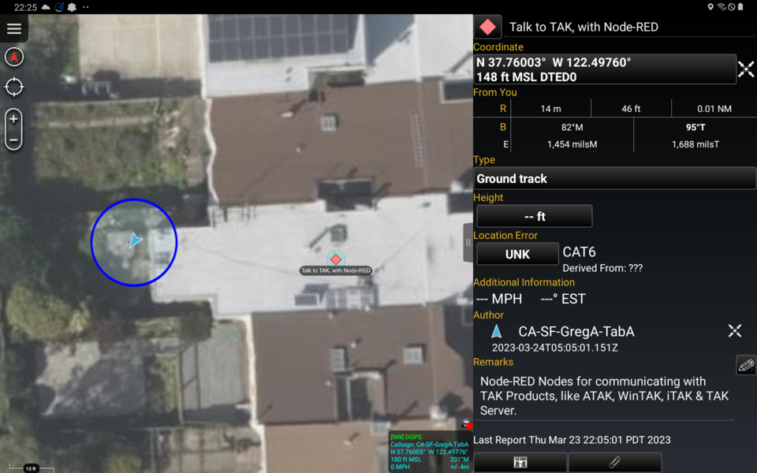

# node-red-contrib-tak: Tactical ETL

[Node-RED](https://www.nodered.org) Nodes for connecting to [TAK Products](https://tak.gov), including ATAK, WinTAK, iTAK & TAK Server. Supports encoding & decoding CoT messages as JSON, plain XML, and both TAK Protocol Version 1 Streaming & TAK Protocol Version 1 Mesh. Other systems that speak Cursor on Target (CoT) or the TAK Protocols are also supported, including COPERS, RaptorX, et al.

[Documentation is available here.](https://node-red-contrib-tak.readthedocs.io/)

# License & Copyright

Copyright 2023 [Sensors & Signals LLC](https://www.snstac.com)

Licensed under the Apache License, Version 2.0 (the "License");
you may not use this file except in compliance with the License.
You may obtain a copy of the License at:

http://www.apache.org/licenses/LICENSE-2.0

Unless required by applicable law or agreed to in writing, software
distributed under the License is distributed on an "AS IS" BASIS,
WITHOUT WARRANTIES OR CONDITIONS OF ANY KIND, either express or implied.
See the License for the specific language governing permissions and
limitations under the License.
