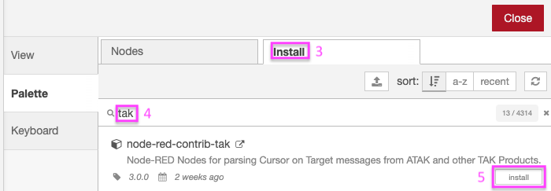

# node-red-contrib-tak: Tactical ETL

[](https://github.com/ampledata/node-red-contrib-tak/raw/main/docs/nr_atak_screenshot.png)

[Node-RED](https://www.nodered.org) Nodes for connecting to [TAK Products](https://tak.gov), including ATAK, WinTAK, iTAK & TAK Server. Supports encoding & decoding CoT messages as JSON, plain XML, and both TAK Protocol Version 1 Streaming & TAK Protocol Version 1 Mesh. Other systems that speak Cursor on Target (CoT) or the TAK Protocols are also supported, including COPERS, RaptorX, et al.


## Install

There are two methods to install this and other Node-RED Nodes:

### Method 1: GUI (preferred)

|  |
| :-- |
| <ol><li>Click the "hamburger" menu in the upper right.</li><li>Click **Manage Palette**</li><ol> | 
|  |
| <ol start=3><li>Select **Install** tab.</li><li>Enter **tak** in search box.</li><li>Click **Install** button.</li></ol> |

### Method 2: CLI (advanced)

Run the following command in your Node-RED user directory - typically `~/.node-red`, then restart node-red:

```bash
cd ~/.node-red
npm install node-red-contrib-tak
```


## Tutorial Videos

These tutorial videos cover installing and using Node-RED and node-red-contrib-tak, as well as highlight a use case for the Australian Capital Territory Emergency Services Agency.

* [Node-RED: JSON to Cursor on Target](https://www.youtube.com/watch?v=5i-y3Nc01Hs)
* [Node-RED TAK on Windows](https://www.youtube.com/watch?v=1mHphHhX4lk)
* [ACT Emergency Services Agency incidents into ATAK using Node-RED](https://www.youtube.com/watch?v=1xDQmRZAtFo)


## Nodes

### TAK Node

|  |
| :-- |
| The TAK Node allows TAK data in any format to be encoded, decoded and transformed between any TAK format. |

|  |
| :-- |
| TAK Node input accepts CoT as a JavaScript Object (JSON), String or Buffer. |

|  |
| :-- |
| TAK Node Output 1 returns either CoT as JSON or String, depending on Input. |

|  |
| :-- |
| TAK Node Output 2 returns CoT as a TAK Protocol Version 1 Mesh encoded Protobuf Buffer. |

|  |
| :-- |
| TAK Node Output 3 returns CoT as a TAK Protocol Version 1 Stream encoded Protobuf Buffer. |

#### Example Flows

| |
| :-- |
| TAK Node example Flow 1: TLS connection to a TAK Server. |

|  |
| :-- |
| TAK Node example Flow 2: UDP Multicast from local network. |

|  |
| :-- |
| TAK Node Example output. |

|  |
| :-- |
| TAK Node example Flow 3: MQTT out to UDP Multicast. |


### TAK2WorldMap Node

|  |
| :-- |
| The TAK2WorldMap Node accepts Cot in any format and outputs Node-RED WorldMap ([RedMap](https://github.com/dceejay/RedMap)) JSON, ready for use by the Worldmap Node. |


# Author

Greg Albrecht <oss@undef.net> https://github.com/ampledata


# Copyright

node-red-contrib-tak is Copyright 2023 Greg Albrecht


# Licenses

Licensed under the Apache License, Version 2.0 (the "License");
you may not use this file except in compliance with the License.
You may obtain a copy of the License at:

http://www.apache.org/licenses/LICENSE-2.0

Unless required by applicable law or agreed to in writing, software
distributed under the License is distributed on an "AS IS" BASIS,
WITHOUT WARRANTIES OR CONDITIONS OF ANY KIND, either express or implied.
See the License for the specific language governing permissions and
limitations under the License.