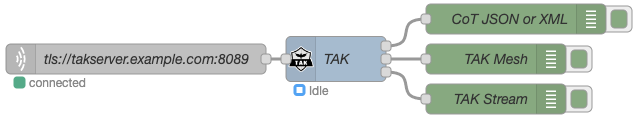
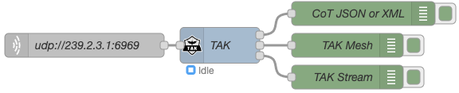
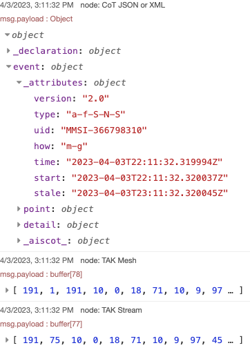
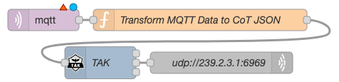

## Example Flows

| |
| :-- |
| TAK Node example Flow 1: TLS connection to a TAK Server. |

|  |
| :-- |
| TAK Node example Flow 2: UDP Multicast from local network. |

|  |
| :-- |
| TAK Node Example output. |

|  |
| :-- |
| TAK Node example Flow 3: MQTT out to UDP Multicast. |
