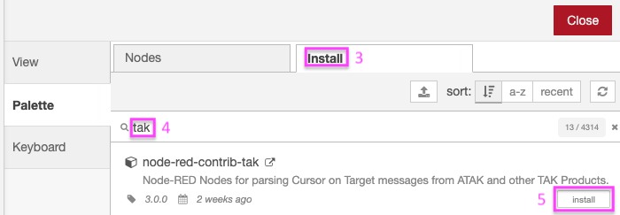
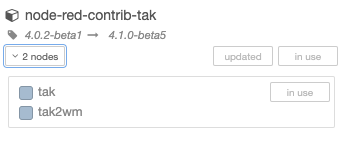
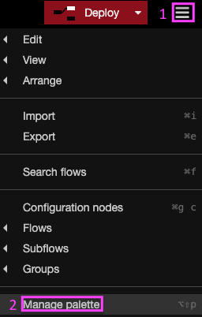
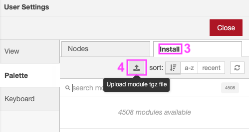
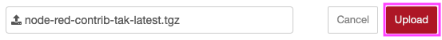

# Installation

There are **3 methods** of installing this Node, chose the method that fits your environment.

## Method A - Node-RED Palette Manager with Internet access

This method requires Internet access for the system running Node-RED. This is most common use-case for the most common Node-RED installations.

1. Click the "hamburger" menu in the upper right.
2. Click **Manage Palette**.


<ol start=3>
  <li>Select <strong>Install</strong> tab.</li>
  <li>Enter <strong>tak</strong> in search box.</li>
  <li>On the node-red-contrib-tak entry, Click <strong>Install</strong> button.</li>
</ol>



After about a minute you should see a success message.

You can confirm installation by clicking the **Nodes** tab:



## Method B - Node-RED Palette Manager without Internet access

This method requires Internet access to download a package, but does not require Internet access on the system running Node-RED.

- I. From a system with Internet access, download an archive of [node-red-contrib-tak](https://github.com/snstac/node-red-contrib-tak/releases/latest/download/node-red-contrib-tak-latest.tgz)
- II. Copy node-red-contrib-tak-latest.tgz to a USB drive (or other removable media).
- III. Insert USB drive or media into system running Node-RED.



<ol start=1>
  <li>Click the "hamburger" menu in the upper right.</li>
  <li>Click <strong>Manage Palette</strong></li>
</ol>



<ol start=3>
  <li>Select <strong>Install</strong> tab.</li>
  <li>Click the <strong>Upload module tgz file</strong> button.</li>
</ol>



<ol start=6>
  <li>Select <strong>Upload</strong>.</li>
</ol>

After about a minute you should see a success message.

You can confirm installation by clicking the **Nodes** tab:


## Method C - NPM with Internet access

This method requires Internet access for the system running Node-RED and command-line (terminal, SSH or serial) access to the system running Node-RED.

Run the following command in your Node-RED user directory - typically `~/.node-red`, then restart node-red:

```bash
cd ~/.node-red
npm install node-red-contrib-tak
node-red-admin restart
```
