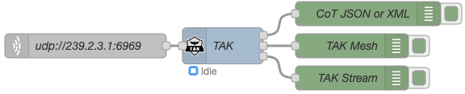

# Nodes

## TAK Node

|                                                                            |
| :-------------------------------------------------------------------------------------------------------- |
| The TAK Node allows TAK data in any format to be encoded, decoded and transformed between any TAK format. |

|                                  |
| :-------------------------------------------------------------------------- |
| TAK Node input accepts CoT as a JavaScript Object (JSON), String or Buffer. |

|           |
| :-------------------------------------------------------------------------- |
| TAK Node Output 1 returns either CoT as JSON or String, depending on Input. |

|                    |
| :-------------------------------------------------------------------------------------- |
| TAK Node Output 2 returns CoT as a TAK Protocol Version 1 Mesh encoded Protobuf Buffer. |

|                         |
| :---------------------------------------------------------------------------------------- |
| TAK Node Output 3 returns CoT as a TAK Protocol Version 1 Stream encoded Protobuf Buffer. |

### Example Flows

|  |
| :----------------------------------------------------------- |
| TAK Node example Flow 1: TLS connection to a TAK Server.     |

|  |
| :----------------------------------------------------------- |
| TAK Node example Flow 2: UDP Multicast from local network.   |

|  |
| :----------------------------------------------------------------- |
| TAK Node Example output.                                           |

|  |
| :----------------------------------------------------------- |
| TAK Node example Flow 3: MQTT out to UDP Multicast.          |

## TAK2WorldMap Node

|                                                                                                                            |
| :-------------------------------------------------------------------------------------------------------------------------------------------------------------------- |
| The TAK2WorldMap Node accepts Cot in any format and outputs Node-RED WorldMap ([RedMap](https://github.com/dceejay/RedMap)) JSON, ready for use by the Worldmap Node. |
