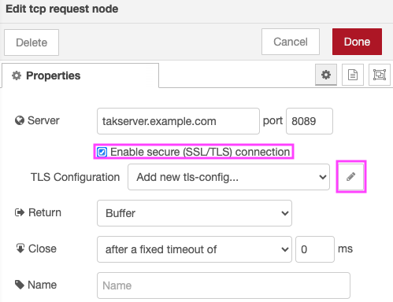
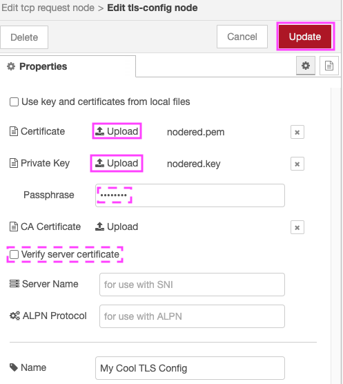
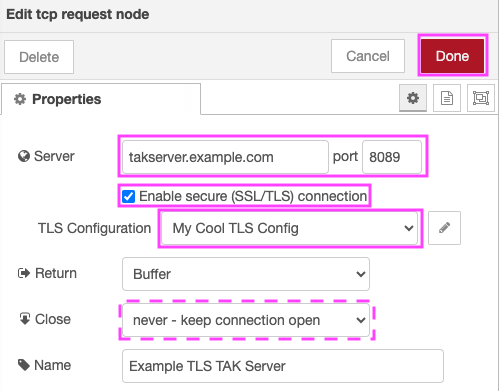

# TAK Server TLS


TAK Server generate two formats of client certificates:

1. PKCS 12 / PKCS#12 / P12
2. PEM

Typically TAK Data Packages are distributed with PKCS#12 (.p12) files.

Node-RED's TCP Nodes uses PEM formatted certificates (and keys).

To use a Node-RED TCP Node with a TAK Server, you must export the certificate and keys from these PKCS#12 files into PEM files.

## Converting from PKCS 12 (.p12) into PEM

If you've been provided with PKCS 12 (.p12) formatted certificates you must first export them in PEM format. This is a two step process:

### Step 1: Export the certificate as PEM

```
openssl pkcs12 -clcerts -nokeys -in example.p12 -out example.cert.pem
```
You should be prompted for an Import Password:
```
Enter Import Password:
```
If confirmed you should receive a MAC verification message:
```
MAC verified OK
```

### Step 2: Export the private key as PEM:

```
openssl pkcs12 -nocerts -nodes -in example.p12 -out example.key.pem
```
You should be prompted for an Import Password:
```
Enter Import Password:
```
If confirmed you should receive a MAC verification message:
```
MAC verified OK
```

### Pro-tip: Default TAK Server certificate passphrase

Your Import Password is the certificate passphrase. All default installations of TAK Server use a common certificate passphrase. Consult your CoreConfig.xml (/opt/tak/CoreConfig.xml).

## Importing TAK Server certificates into Node-RED

Once PEM certificate and private key are in hand, open Node-RED and add a TCP (request, input or output) Node to your Flow:


Open the Node Properties dialog.

- Enter your server name or IP, port, and check **Enable secure (SSL/TLS) connection**.
- Click the pencil icon to **Add new tls-config...**.



- Click Certificate **Upload** to upload your PEM certificate file.
- Click Private Key **Upload** to upload your PEM private key.
- Enter your Private Key passphrase (if your private key is still encrypted).
- Click **Add**.



Click **Done**.


